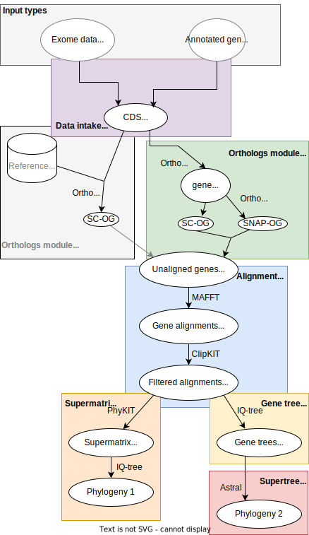

===========================
Advanced Tutorial
===========================

Changing workflow settings
==========================

Some workflow settings can be changed by passing arguments to the command-line tool (``orthoflow``). 

To see a complete list of command-line arguments, run:

.. code-block::

    orthoflow --help

You can pass any snakemake arguments to orthoflow. To list these, run:

.. code-block::

    orthoflow --help-snakemake 

Most settings to operate and tune aspects of the workflow can be changed by editing the standard configuration file (``orthoflow/config/config.yml``) or writing a custom configuration file that can be passed to the workflow. You will see examples of changes to the configuration file throughout this tutorial.

Cores
=====

To manually set the number of cores, set the ``--cores`` flag. For example, to use 24 cores:

.. code-block::

    orthoflow --cores 24    

If ``--cores`` is not set, then it will use all available CPU cores.

Setting working directory and specifying targets
================================================

To set a working directory different to the current directory, use the `--directory` flag:

.. code-block::

    orthoflow --directory path/to/working/dir

To use a specific target, give that as an argument. For instance to produce the list of protein alignments, run as follows

.. code-block::

    orthoflow results/alignment/alignments_list.protein.txt

Controlling the flow of operations
==================================

By default, Orthoflow uses the *de novo* orthology inference module (OrthoFinder and OrthoSNAP) and supermatrix-based tree inference (supermatrix module).

This can be changed in the configuration file. Setting the ``use_orthofisher`` to ``True`` will enable the ortholog fishing module instead of the *de novo* orthology inference module. This also requires you to specify a set of HMM profiles listed under ``orthofisher_hmmer_files``. For example:

.. code-block::

    use_orthofisher: True
    orthofisher_hmmer_files:
    - hmms/1080at3041.hmm
    - hmms/1103at3041.hmm
    - hmms/1271at3041.hmm
    - hmms/1379at3041.hmm
    - hmms/1518at3041.hmm
    - hmms/1569at3041.hmm
    - hmms/1610at3041.hmm

The orthofisher and orthofinder paths are mutually exclusive.

By default, a phylogeny is inferred from a supermatrix. To use the supertree (ASTRAL) path for tree inference, set ``supertree: True``. If both ``supermatrix`` and ``supertree`` are set to ``True``, the workflow will run both types of inference.

You can also run the workflow up to any given point by specifying the rule with the snakemake `--until`` flag, specifying the rule where you'd like to stop. An example might be where you want to produce the CDS nucleotide alignments for all orthogroups but no trees. In that case you could set the `infer_tree_with_protein_seqs: False` to indicate that you wish nucleotide alignments to be produced, activate supermatrix inference (`supermatrix: True`) but keep snakemake from actually producing the supermatrix using `--until concatenate_alignments`. Snakemake will run everything up until the start of this rule (which concatenates the single-gene alignments into the supermatrix), so the output will include the DNA alignments.

Gene and alignment filtering settings
=====================================

There are several steps in the workflow that filter out genes not meeting particular criteria. 

Minimum taxa
------------
One important setting is the minimum number of taxa that need to be in a gene dataset in order for it to be retained. This can be set with the ``ortholog_min_seqs`` setting in the configuration file. The default value is 5. The value should not be set to less than 3. The occupancy setting for OrthoSNAP can be changed with ``orthosnap_occupancy``; by default we use the same value as that for ``ortholog_min_seqs``.

Using SC-OGs and/or SNAP-OGs
----------------------------
The traditional approach towards inferring species trees from genome data is to select single-copy orthogroups (SC-OGs). One of the innovations we've implemented in this workflow is the use of SNAP-OGs, sets of orthologous sequences derived from multi-copy gene families, which can yield orders of magnitude more data. You can set whether you want to build a phylogeny from just the SC-OGs, just the SNAP-OGs or both combined by setting the ``orthofinder_use_scogs`` and ``orthofinder_use_snap_ogs`` in the configuration file. In this example both SC-OGs and SNAP-OGs are combined for phylogenetic inference:

.. code-block::

    use_scogs: True
    use_snap_ogs: True

SNAP-OGs are currently only implemented in the *de novo* ortholog analysis path. When using the ortholog fishing path, only SC-OGs will be used for downstream analyses.

Alignment trimming
------------------
Alignments are trimmed for quality with the smart gap method implemented in `ClipKit <https://doi.org/10.1371/journal.pbio.3001007>`_.

Removal of heavily trimmed alignments
-------------------------------------
In some cases, it may make more sense to remove genes that have been decimated by the alignment trimming proceduce, particularly if they are going to be used individually to infer gene trees. There are two ways to achieve his. First, any alignments that fall below a given number of amino acid positions after trimming will be removed (default: 167 amino acid positions or 501 corresponding nucleotide positions, can be changed with ``minimum_trimmed_alignment_length_cds`` and ``minimum_trimmed_alignment_length_proteins`` parameters in the config file). Second, the workflow also allows removing alignments from which a large proportion was removed in the trimming step. By default, alignments that lose half of their length in trimming get removed (change by setting the ``max_trimmed_proportion`` parameter in the config file).

Tree inference settings
=======================

The phylogenetic analysis can be run on protein and/or nucleotide sequences. This can be set in the config file with ``infer_tree_with_cds_seqs`` and ``infer_tree_with_protein_seqs``. The default setting is to do 2 different analyses with protein and nucleotide sequences. ``infer_tree_with_cds_seqs`` should be set to ``False`` when 1 or more amino acid input files are used in the input.

To use an outgroup in the phylogenetic analysis, specify an outgroup taxon (using its value in the ``taxon_string`` column in the input sources file). For example, for the demonstration dataset ``outgroup: "Derbesia_sp_WEST4838"``. The outgroup will only be used in the supermatrix path. We are not including this functionality for the gene tree path as the outgroup might not be present in each alignment.

To specify a model of sequence evolution, the config file has a ``model_string`` setting where you can specify a model following the IQ-tree syntax. The default setting ``model_string: "-m TEST"`` will perform model testing to determine a suitable model. but any model implemented in IQ-tree can be specified here. For instance "-m GTR+F+G" for a nucleotide General Time Reversible (GTR) model with empirical base frequencies (+F) and a discrete gamma model (+G) for rate heterogeneity. For further information on the model options and their specification, see the `IQ-tree documentation <https://www.iqtree.org/doc/Command-Reference#specifying-substitution-models>`_

For bootstrapping, you can specify the ``bootstrap_string`` variable in the config file. By default, this is set to ``bootstrap_string: "-bb 1000"`` to carry out 1000 ultrafast bootstrap replicates. To change this to 100 standard (nonparametric) bootstraps, for instance, use ``bootstrap_string: "-b 100"``. See the `IQ-tree documentation <http://www.iqtree.org/doc/Tutorial#assessing-branch-supports-with-ultrafast-bootstrap-approximation>`_ for further information on how to specify bootstrapping.

